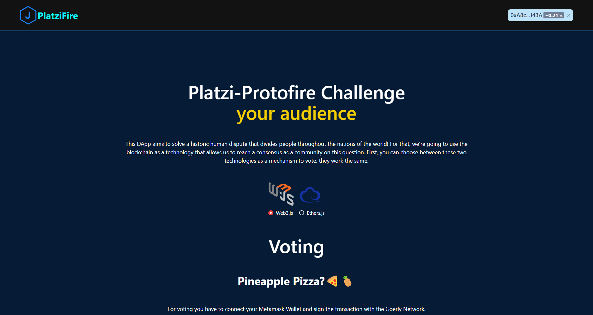

# Platzi and Protofire Web3.js-Ethers.js Challenge

## Description

This Dapp is a voting system that allows an Ethereum address to vote only once on a binary proposal with a cost of 0.01 ETH choosing its favorite frontend-web3 library: web3.js or ethers.js. For this, the Dapp works in the Görli testnet and is connected with MetaMask.

When a user votes, it can see the result so far (number of positive votes vs. number of negative votes).

[Demo of the Dapp](https://platzi-web3-libs-roan.vercel.app/)

The smart contract is deployed at `0xacfc7725527ba2ee4311574f65e5d76f9f9585e9`. You can see it [here](https://goerli.etherscan.io/address/0xacfc7725527ba2ee4311574f65e5d76f9f9585e9#code).

## Stack and tools

For this challenge the next technologies were used:
1. React.js for the frontend.
2. Chakra-UI for UI/UX.
3. Web3.js and Ethers.js for the integration with the Smart Contract.
4. Solidity on the side of the Smart Contract.

To use this Dapp is necessary Metamask and a funded Görli account. You can get Görli ether [here](https://faucet.paradigm.xyz/).
